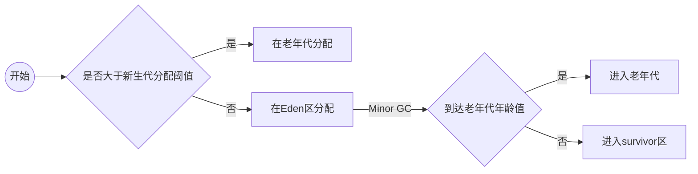

# 内存分配与回收策略

java的内存分配和回收，往大方向上讲，就是在java堆上进行的分配与回收。大多数是分配在Eden区，少部分可以直接分配在老年代。具体如何分配，取决于选择的垃圾收集器以及配置的JVM参数。

java堆分区图：

java堆内存分配相关参数介绍

| 参数              | 作用                             |
| ----------------- | -------------------------------- |
| -XX:SurvivorRatio | Eden区和一个Survivor区的空间比例 |
| -Xms              | java堆初始内存                   |
| -Xmx              | java堆最大内存                   |
| -Xmn              | 分给新生代的内存                 |

对象分配图

