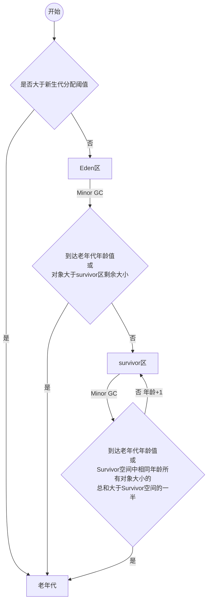

# 内存分配与回收策略

[TOC]

java的内存分配和回收，往大方向上讲，就是在java堆上进行的分配与回收。大多数是分配在Eden区，少部分可以直接分配在老年代。具体如何分配，取决于选择的垃圾收集器以及配置的JVM参数。

## java堆分区图

## 堆内存分配jvm相关参数介绍

| 参数              | 作用                             |
| ----------------- | -------------------------------- |
| -XX:SurvivorRatio | Eden区和一个Survivor区的空间比例 |
| -Xms              | java堆初始内存                   |
| -Xmx              | java堆最大内存                   |
| -Xmn              | 分给新生代的内存                 |

## 分代晋升图

## 分代JVM参数介绍

| 参数                       | 作用                                       | 备注                         |
| -------------------------- | ------------------------------------------ | ---------------------------- |
| -XX:PretenureSizeThreshold | 新生代分配阈值，对象大于次值直接进入老年代 | 只对Serial和ParNew收集器有效 |
| -XX:MaxTenuringThreshold   | 年龄大于此值进入老年代                     | 默认为15                     |

## 问题

什么时候会触发垃圾回收？

Serial新生代内存不足时产生minor gc

Survivor空间小于等于50%时，年龄最大的一代进入老年代