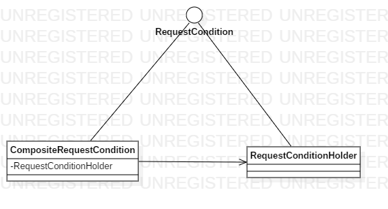

# SpringMVCDesign

本文将介绍SpringMVC框架中使用到的设计模式

### 责任链模式

SpringMVC中比较常见的一种设计模式，以CompositeXXX或XXXComposite命名，接下来我们通过阅读CompositeRequestCondition类来分析责任链模式在SpringMVC中的使用

```java
//org.springframework.web.servlet.mvc.condition.CompositeRequestCondition
//忽略了具体继承类
public class CompositeRequestCondition extends implements RequestCondition {
	//请求条件，RequestConditionHolder类也继承RequestCondition接口
    private final RequestConditionHolder[] requestConditions;
	//获取匹配条件
    public CompositeRequestCondition getMatchingCondition(HttpServletRequest request) {
        if (this.isEmpty()) {
            return this;
        } else {
            RequestConditionHolder[] matchingConditions = new RequestConditionHolder[this.getLength()];
			//对每个RequestConditionHolder进行遍历获取其匹配条件
            for(int i = 0; i < this.getLength(); ++i) {
                matchingConditions[i] = this.requestConditions[i].getMatchingCondition(request);
                if (matchingConditions[i] == null) {
                    return null;
                }
            }

            return new CompositeRequestCondition(matchingConditions);
        }
    }
}
```

关键代码已添加注释

如代码中所示，ComposoteRequestCondition类中包含了所有的RequestConditionHolder，当需要匹配条件时对所有的RequestConditionHolder进行匹配。类图如下



### 模板模式

在父类中规定方法的流程，子类负责实现，在SpringMVC中多是抽象类规定流程而实现类负责实现

```java
public abstract class AbstractHandlerMapping extends WebApplicationObjectSupport{
        protected void initApplicationContext() throws BeansException {
            this.extendInterceptors(this.interceptors);
            this.detectMappedInterceptors(this.adaptedInterceptors);
            this.initInterceptors();
        }
}
```

如代码中的initApplicationContext方法，在AbstractHandlerMapping中已经规定了要做哪些事情，凡是继承AbstractHandlerMapping的类的初始化都通过这个方法来初始化

### 适配器模式

SpringMVC处理请求的流程就是适配器模式的具体体现，其中DispatcherServlet作为适配者，HandlerAdapter是适配器，HandlerExecutionChain为目标类

### 观察者模式