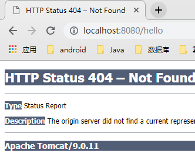

# SpringMVC处理请求流程

### helloworld测试流程

1. 新建SpringMVC项目

2. 在dispatcher-servlet.xml中开启注解扫描

   ```xml
   <context:component-scan base-package="com.vay" />
   ```

3. 新建测试helloworl的类并打上注解

   ```java
   @Controller
   public class MainController {
   
       @RequestMapping("/hello")
       public String helloworld(){
           System.out.println("hello");
           return "index.jsp";
       }
   
   }
   ```

4. 测试RestController和GetMapping，发现无效

   ```java
   @RestController
   public class MainController {
   
       @GetMapping("/hello")
       public String helloworld(){
           System.out.println("hello");
           return "index.jsp";
       }
   
   }
   ```

   **错误页面**

   

   **错误log**

   ```
   org.springframework.web.servlet.PageNotFound.noHandlerFound No mapping found for HTTP request with URI [/hello] in DispatcherServlet with name 'dispatcher'
   ```

5. 在dispatcher-servlet.xml中配置**<mvc:annotation-driven />**

6. 测试成功

### 请求流程

当浏览器发送请求给我们的服务，springmvc又会经历了哪些步骤呢？

首先我们在web.xml中配置的Servlet为DispatcherServlet，那么入口应该就是DispatcherServlet#doService()方法。doService方法中做了一些准备与扫尾工作，具体交给了doDispatch方法，流程图如下

```sequence
	doDispatch()-->HandlerMappings:getHandler
	HandlerMappings->doDispatch():Handler
	doDispatch()-->HandlerAdapters:getHandlerAdapter(Handler)
	HandlerAdapters->doDispatch():HandlerAdapter
	doDispatch()-->doDispatch():HandlerAdapter.handle(Handler)
	doDispatch()-->doDispatch():渲染页面
```

如上图所示，DispatcherServlet先从HandlerMappings中获取request对应的Handler，再从HandlerAdapters中获取HandlerAdapter，而后让HandlerAdapter使用Handler执行，最好处理结果，渲染页面