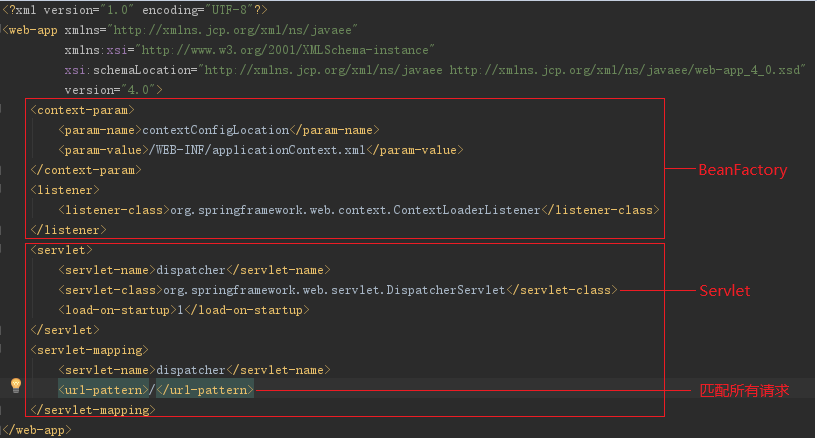
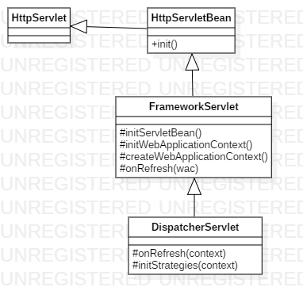

# SpringMVC初始化源码分析

springmvc是一个web框架，所以遵守servlet规范，而对于servlet而言，需要在web.xml中配置servlet（不包括不需要web.xml的情况），IDEA在创建springmvc项目时已经替我们完成了这一工作。



那么对于servlet而言，其启动的初始化操作应该时在一个无参的init()方法中完成的，那么DispatcherServlet中的init()做了哪些工作呢？

我们在DispatcherServlet类中并没有找到init()方法，难道DispatcherServlet中没有任何初始化的操作？不可能，它可能是将初始化的操作交给了父类去完成了。果然，我们在其父类的父类**HttpServletBean**中找到了init()方法，而其中的关键代码为**this.initServletBean()**，但是在HttpSevletBean中的实现为空，于是我们就去其父类中找到了其实现的逻辑，关键代码为**this.webApplicationContext = this.initWebApplicationContext()**。

上述就是springmvc初始化时的流程

------------

------

### 源码分析

接下来我们深入代码来看看springmvc究竟做了些什么初始化工作

DispatcherServlet的init()方法在其祖类HttpServletBean中实现，而WebApplicationContext初始化的实现逻辑由其父类FrameworkServlet实现完成，其类图如下



那么在initWebApplicationContext()方法中究竟做了哪些事情呢？

1. 获取spring的跟容器rootContext
2. 设置webApplicationContext并根据情况调用onRefresh方法
3. 将webApplicationContext设置到ServletContext中

> rootContext、webApplicationContext都是ServletContext中的一个attribute
>
> ServletContext的作用域为一次服务的开启到关闭

而onRefresh方法究竟做了些什么呢？源代码如下

```java
    protected void onRefresh(ApplicationContext context) {
        this.initStrategies(context);
    }

    protected void initStrategies(ApplicationContext context) {
        this.initMultipartResolver(context);
        this.initLocaleResolver(context);
        this.initThemeResolver(context);
        this.initHandlerMappings(context);
        this.initHandlerAdapters(context);
        this.initHandlerExceptionResolvers(context);
        this.initRequestToViewNameTranslator(context);
        this.initViewResolvers(context);
        this.initFlashMapManager(context);
    }
```

可以看到onRefresh方法就是将springmvc的9大组件进行了初始化，接下来简单的罗列一下9大组件及其作用

- HandlerMapping：处理匹配器，根据request找到对应的Handler和Interceptors
- HandlerAdapter：处理适配器，使用Handler处理request
- HandlerExceptionResolver：解析对请求做处理过程中产生的异常
- ViewResolver：视图解析器，将String类型的视图名和Locale解析为View类型的视图
- RequestToViewNameTranslator：从Request中获取viewName
- LocalResolver：从request中解析出Locale
- FlashMapManager：在重定向中传递参数
- ThemeResolver：解析主题
- MultipartResolver：处理上传请求

至此，springmvc的初始化全部完成

### Q&A

1. 注解过的类是什么时候被添加到applicationContext的？

   初始化webApplicationContext的时候，org.springframework.context.support.AbstractRefreshableApplicationContext#refreshBeanFactory()