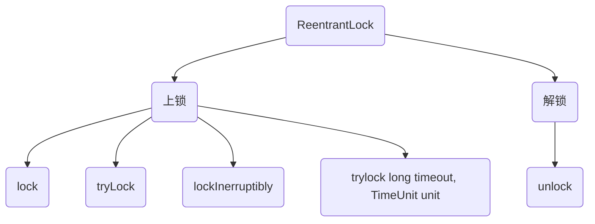
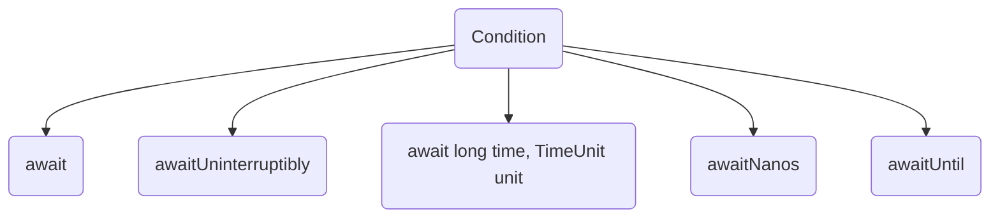

# AQS框架

[TOC]

说起Java并发编程就不得不提AQS，那么什么是AQS呢？AQS是java.util.concurrent包中的一个虚拟类——AbstractQueuedSynchronizer。这个类为concurrent包中的同步类提供了基础实现思路。

既然说到并发编程，那么就离不开线程的暂停与执行。在Java中，有且仅有四种方式使线程暂停

- Thread类中的sleep等方法
- Object类中的wait方法
- 竞争synchronized锁
- LockSupport类中的park方法

AQS框架中的线程暂停使用的就是第四种——LockSupport#park方法


## 内部类

在AQS框架中，我们维护一个节点有状态区分的双向链表，这个双向链表称为CLH队列。

在AQS框架中，有两个内部类

- Node
- ConditionObject

前者用来实现CLH列表，后者则间接实现Object#wait和Object#notify、Object#notifyAll

### Node

Node作为构成CLH队列的节点，它有如下几个域

| 域名       | 备注                     |
| ---------- | ------------------------ |
| prev       | 前序节点                 |
| next       | 后序节点                 |
| waitstatus | 节点状态                 |
| nextWaiter | 标记节点状态：独占或共享 |

而对于waitstatus，有指定的几个值分别代表着不同的意思

- CANCALLED：取消状态，代表当前节点已经被取消
- SIGNAL：标机状态，代表该节点的后序节点应该被unpark
- CONDITION：等待状态，代表该节点位于等待列表中
- PROPAGATE：传播状态，代表该节点被释放后应当被传播
- 0：初始状态

在AbstractQueueSynchronizater类中保存CLH列表的首尾节点以及列表的状态

| 域名   | 备注                           |
| ------ | ------------------------------ |
| head   | 首节点                         |
| tail   | 尾节点                         |
| status | 状态，记录当前锁被多少节点申请 |

那么接下来我们跟着两个AbstractQueueSynchronizer的实现类来熟悉一下AQS框架是如何实现锁的


#### ReentrantLock

AbstractQueueSynchronizer推荐其实现类作为一个内部类，在ReentrantLock中AbstractQueueSynchronizer的实现类就是作为内部类出现的，ReentrantLock的类图如下

可以看到Syns类继承了AbstractQueueSynchronizer类，并且实现了部分方法，而FairLock和NonFairLock则是实现了Syns的全部方法。那么我们就从ReentrantLock类的职责进而分析其代码逻辑

ReentrantLock从名字而言，这是一个可重入锁，那么顾名思义，首先这个类是一个锁，其次这个锁是可重入的。作为锁而言，最重要的就是上锁和解锁两个功能，以下就是ReentrantLock的上锁解锁方法



初始值为0，排队后将节点状态设置为SIGNAL


### ConditionObject

ConditionObject类是Condition接口的实现类，在ConditionObject类中，同样维护了一个由Node节点构成的链表，并保存这个链表的首尾节点

| 域名      | 备注   |
| --------- | ------ |
| FirstNode | 首节点 |
| LastNode  | 尾节点 |

类比Object#wait方法，在使用Object#wait，Object#notify之前必须获取synchronized的锁。同样的，在使用Condition#await，Condition#signal方法时，要获得对应的lock，否则就会抛出异常，除此之外，Condition还在其基础上扩展了其功能



两次重入锁的话一次卸载不下来

## 公用方法

在AQS框架中有这些方法可供使用

请求锁的方法

acquire

非公平锁：首先使用cas进行抢占，抢占失败后进行正常获取，获取不到则进入CLH队列中排队等待

公平锁：尝试获取，获取不到则进入CLH队列中排队等待

tryacquire

使用cas进行抢占，抢占失败后进行正常获取，获取不到则进入CLH队列中排队等待

请求共享锁的方法

acquireShare

释放锁的方法

release

releaseshare

## 设计模式

在AQS框架中使用到了模板方法模式

在AbstractQueueSynchronizer类中规定模板

```java
protected void acquire() {
    if(!tryAcquire()&&ShouldParkifFailAcquire()&&ParkAfterAcquire())
        Thread.intrrrupt();
}
```

其中tryAcquire方法由子类进行具体实现

## 相关类图

## Q&A

如何获取