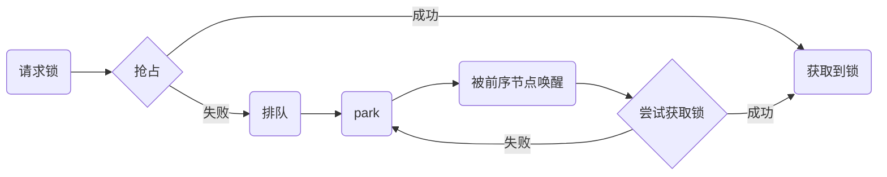

# AQS框架

在Java中有两套并发锁框架，一套是以Synchronized关键字为锁，以Object类为辅的框架，另一套就是以AQS框架为基础，Condition接口为辅的框架。

那么什么是AQS呢？AQS是AbstractQueueSynchronizer类的简称，这个类提供了一套完整的并发框架给其他的并发类使用，现如今，在concurrent包中的大部分工具类都直接间接的使用到了这个框架。

[TOC]

## CLH Queue

在AQS框架中，锁的获取释放，线程的阻塞排队，都是通过对一个称为“CLH Queue”，又称为“Sync Queue”的数据结构的操作来完成的。这个CLH队列是一个双向链表，其节点Node类有如下域

| 域名       | 类型         | 备注     |
| ---------- | ------------ | -------- |
| prev       | Node         | 前序节点 |
| next       | Node         | 后续节点 |
| nextWaiter | Node         | 节点模式 |
| waitStatus | voletite int | 状态     |

在其类中还有一些常量的字段

```java
/** 标记当前节点是共享模式 */
static final Node SHARED = new Node();
/** 标记当前节点是共享模式 */
static final Node EXCLUSIVE = null;

/** waitStatus值表明当前线程已取消 */
static final int CANCELLED =  1;
/** waitStatus值表明后继线程应该被释放 */
static final int SIGNAL    = -1;
/** waitStatus值表明当前线程在condition中等待 */
static final int CONDITION = -2;
/** waitStatus值表明下一个请求共享的线程应该被无条件传播 */
static final int PROPAGATE = -3;
```

在AbstractQueueSynchronizer类中，主要维护四个域

| 域名                 | 类型         | 备注     |
| -------------------- | ------------ | -------- |
| first                | Node         | 首节点   |
| last                 | Node         | 尾节点   |
| status               | volitite int | 状态     |
| exclusiveOwnerThread | Thread       | 独占线程 |

既然AQS是锁框架，那么就离不开锁的常用操作上锁、解锁、等待锁，那么AQS是如何实现的呢？

- 上锁：status加一，将独占线程设置为当前线程
- 解锁：status减一，将独占线程置空
- 等待锁（竞争锁）：将当前线程包装为Note，添加到CLH队列中排队

::: tip

这里需要注意的是，为了防止出现的情况，对status的操作都是使用CAS来操作的

:::

要了解AQS框架就首先要明白CLH队列，接下来我们就从三个类来了解AQS


## ReentrantLock

ReentrantLock翻译成中文是重入锁的意思，那么我们就从两个角度去了解这个类

1. 重入
2. 锁

ReentrantLock类的类图如下

可以看到，其内部类Sync继承了AbstractQueueSynchronizer类，而后FairLock和NorFairLock类又继承了Sync类。我们来对其lock方法进行解析，看看上锁的过程对AQS产生了怎样的影响

```Java
/**公平锁只有acquire(1)方法，没有if-else逻辑判断 */
final void lock() {
    if (compareAndSetState(0, 1))
        setExclusiveOwnerThread(Thread.currentThread());
    else
        acquire(1);
}
/**
 * 就方法名的语义可以看出
 * 1. 尝试请求锁，成功则结束
 * 2. 请求失败则将当前线程当作Node进行排队
 * 3. 排队获取到锁后查看当前线程释放被中断过
 * 
 * 其中tryAcquire(int)使用了模板方法模式，将具体的实现交给子类去完成，也就是Sync类
 */
public final void acquire(int arg) {
    if (!tryAcquire(arg) &&
        acquireQueued(addWaiter(Node.EXCLUSIVE), arg))
        selfInterrupt();
}
/**非公平锁的tryAcquire*/
final boolean tryAcquire(int acquires) {
    final Thread current = Thread.currentThread();
    int c = getState();
    //锁是闲置状态，尝试用CAS获取并将独占线程设置为自己
    if (c == 0) {
        if (compareAndSetState(0, acquires)) {
            setExclusiveOwnerThread(current);
            return true;
        }
    }
    //独占线程是否是自己，是则是重入
    else if (current == getExclusiveOwnerThread()) {
        int nextc = c + acquires;
        if (nextc < 0) // overflow
            throw new Error("Maximum lock count exceeded");
        setState(nextc);
        return true;
    }
    return false;
}
/**尝试获取并阻塞*/
final boolean acquireQueued(final Node node, int arg) {
    boolean failed = true;
    try {
        boolean interrupted = false;
        //死循环，触发抛出异常或者获取到锁才会返回
        for (;;) {
            final Node p = node.predecessor();
            if (p == head && tryAcquire(arg)) {
                setHead(node);
                p.next = null; // help GC
                failed = false;
                return interrupted;
            }
            if (shouldParkAfterFailedAcquire(p, node) &&
                //在这里暂停
                parkAndCheckInterrupt())
                interrupted = true;
        }
    } finally {
        if (failed)
            cancelAcquire(node);
    }
}
```

根据上述代码，非公平锁申请锁的流程如下



可以看到，在不同的方法中分别对咱们的AQS域产生了影响

- lock()：第一个if判断如果成功则会影响status和exclusiveOwnerThread
- lock()：第一个if判断如果失败则会在子方法中影响first和last

同样的，重入的实现在上述代码中同样得到了实现，就在tryAcquire()方法中。

在上述流程图中可以看到，线程是使用LockSupport#park()方法进行暂停的，那么前序节点是如何对其进行唤醒呢？让我们一起来看一看unlock方法

```java
public void unlock() {
    sync.release(1);
}

public final boolean release(int arg) {
    if (tryRelease(arg)) {
        Node h = head;
        if (h != null && h.waitStatus != 0)
            //unpark后继节点
            unparkSuccessor(h);
        return true;
    }
    return false;
}
```

可以看到，在unlock方法中会对起后继节点调用unpark方法