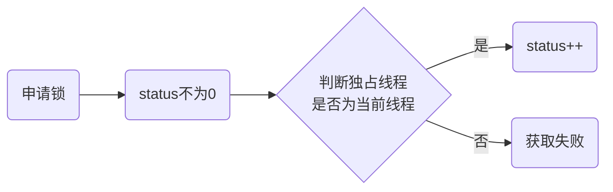

# AQS框架

AbstractQueueSynchronizer抽象类就是AQS框架，这个类为使用Java类实现锁提供了规范与思路。要理解AQS框架，最重要的是理解“CLH Queue”，这是队列的数据结构为双向链表，链表上每个节点的值只有固定的5个，分别代表不同的涵义，接下来我们就从CLH队列为切入点了解AQS

既然CLH Queue是一个双向链表，那么AbstractQueueSynchronizer类就一定符合双向链表的两个特征

- 在AbstractQueueSynchronizer类中一定保存了其首节点和尾节点
- 每个节点一定保存了其前序节点、后序节点以及自己的值

于是乎，我们在AbstractQueueSynchronizer类中找到了如下私有域

| 域名                 | 类型         | 备注     |
| -------------------- | ------------ | -------- |
| first                | Node         | 首节点   |
| last                 | Node         | 尾节点   |

而Node节点的域也果然如我们所料

| 域名       | 类型         | 备注     |
| ---------- | ------------ | -------- |
| prev       | Node         | 前序节点 |
| next       | Node         | 后续节点 |
| waitStatus | voletite int | 状态     |

上文中提到，Node节点的值有且只有5个，每个值都有特殊的含义，那么接下来我们就来看看这些值具体有什么意义呢？

```java
/** waitStatus值表明当前线程已取消 */
static final int CANCELLED =  1;
/** waitStatus值表明后继线程应该被释放 */
static final int SIGNAL    = -1;
/** waitStatus值表明当前线程在condition中等待 */
static final int CONDITION = -2;
/** waitStatus值表明下一个请求共享的线程应该被无条件传播 */
static final int PROPAGATE = -3;
```

上边那四个再加上一个无意义的0值，就是waitStatus所可以取到的值

开头我们说到，AQS框架为使用Java实现锁提供了规范和思路，那么它到底是如何规范的呢？首先我们抛出三个问题：

1. 如何实现上锁？
2. 如何实现A获取到锁之后其余线程获取失败并等待？
3. 在A释放锁后如何通知等待线程可以获取锁了？

我们通过看几个方法来理解这三个问题，首先说第一个问题，既然是上锁，那么方法名一定是和lock相关的，全局搜索发现并没有方法名是和lock相关的，难道AQS没有上锁机制？肯定是不可能的，我们在acquire的注释中找到了lock字眼，那么就来看一下acquire方法吧

```java
public final void acquire(int arg) {
    //尝试获取锁
    if (!tryAcquire(arg) &&
        //没获取到，排队去了
        acquireQueued(addWaiter(Node.EXCLUSIVE), arg))
        selfInterrupt();
}
```

ok，那说明咱们第一个问题的答案在tryAcquire方法中，再看一段

```java
protected boolean tryAcquire(int arg) {
	throw new UnsupportedOperationException();
}
```

很尴尬，AQS框架中并不负责上锁方法的实现，而是把这个方法的实现交给了子类去完成

::: tip

这种将实现下沉的代码实现称为模板方法模式，是各种优秀框架源码中常用的设计模式之一

:::

那么第二个问题，emmm...貌似有点大，分解一下

- A线程获取锁其余线程如何获取失败？
- 如何实现获取锁失败后等待？

很明显，分解后的第一个问题也在tryAcuqire里，手动笑哭，AQS好懒。。。接下来我们贴第二个问题的一段代码

```java
final boolean acquireQueued(final Node node, int arg) {
    boolean failed = true;
    try {
        boolean interrupted = false;
        for (;;) {
            final Node p = node.predecessor();
            //前序节点是头结点吗？是的话我就要尝试获取锁了
            if (p == head && tryAcquire(arg)) {
                setHead(node);
                p.next = null; // help GC
                failed = false;
                return interrupted;
            }
            //获取锁失败后应该暂停吗？应该的话就暂停吧
            if (shouldParkAfterFailedAcquire(p, node) &&
                parkAndCheckInterrupt())
                interrupted = true;
        }
    } finally {
        //只有获取到锁才会将这个标志改成false，非正常退出都会把这个节点取消掉
        if (failed)
            cancelAcquire(node);
    }
} 
//将当前线程做成一个Node节点，排队到CLH Queue，下边代码是添加到双向链表的代码，没啥说的
private Node addWaiter(Node mode) {
    Node node = new Node(Thread.currentThread(), mode);
    // Try the fast path of enq; backup to full enq on failure
    Node pred = tail;
    if (pred != null) {
        node.prev = pred;
        if (compareAndSetTail(pred, node)) {
            pred.next = node;
            return node;
        }
    }
    //这个方法里也是把Node节点排队到CLH Queue
    enq(node);
    return node;
}
```

可以看到，在acquireQueued()方法中有一个死循环，只有前序节点是头结点并且尝试获取锁成功才会返回，但是大牛的底层代码一定不会这么蠢，否则也太浪费CPU了，于是增加了shouldParkAfterFailedAcquire()和parkAndCheckInterrupt()方法来将线程暂停掉。那么当前序节点的状态为什么时我们需要对其进行暂停呢？

- CANCELLED：前序节点都被取消了肯定不应该暂停啊，赶紧去抢锁才对
- SIGNAL：当前节点的后继节点应该被释放，那后继节点肯定要先被暂停才能被释放啊
- Condition：Condition队列专用，不作考虑
- PROPAGATE：无条件传播，也应该释放

```java
private static boolean shouldParkAfterFailedAcquire(Node pred, Node node) {
    int ws = pred.waitStatus;
    //SIGNAL
    if (ws == Node.SIGNAL)
        return true;
    //CANCELLED
    if (ws > 0) {
        do {
            node.prev = pred = pred.prev;
        } while (pred.waitStatus > 0);
        pred.next = node;
    //将前序节点的状态设置为SIGNAL
    } else {
        compareAndSetWaitStatus(pred, ws, Node.SIGNAL);
    }
    return false;
}
```

ok，接下来我们来了解第三个问题，释放后序节点，既然是释放，那我们就来看一下release方法吧

```java
public final boolean release(int arg) {
    //尝试释放
    if (tryRelease(arg)) {
        Node h = head;
        if (h != null && h.waitStatus != 0)
            unparkSuccessor(h);
        return true;
    }
    return false;
}
```

没错，在release方法中会让后继节点继续运行，tryRelease也是一个模板方法，由子类完成

ReentrantLock是AQS框架的实现类之一，我们可以通过对这个类的学习来看看加锁和解锁具体是如何实现的

## ReentrantLock

ReentrantLock是一个可重入的锁，其类图如下

在ReentrantLock类中，我们就可以回答如何上锁的问题了，值得一提的是，ReentrantLock在AQS框架的帮助下实现了Lock接口

同样的，我们先来看一段代码

```java
final boolean nonfairTryAcquire(int acquires) {
    final Thread current = Thread.currentThread();
    int c = getState();
    //排他
    if (c == 0) {
        //上锁
        if (compareAndSetState(0, acquires)) {
            setExclusiveOwnerThread(current);
            return true;
        }
    }
    //重入
    else if (current == getExclusiveOwnerThread()) {
        int nextc = c + acquires;
        if (nextc < 0) // overflow
            throw new Error("Maximum lock count exceeded");
        setState(nextc);
        return true;
    }
    return false;
}
```

可以看到，上锁有两个步骤来完成的

1. 设置status的值
2. 设置独享线程为当前线程

在这里就使用到了AQS框架中的另外两个域

| 域名       | 类型         | 备注     |
| ---- | ---- | ---- |
| status               | volitite int | 状态     |
| exclusiveOwnerThread | Thread       | 独占线程 |

只有当status为0是，说明这个锁从未被获取过，通过对status值的判断实现了排他性，当然还有一个重入的概念，我们下边再介绍

知道了如何上锁，那我们想一想应该如何解锁的？既然上锁改变了两个值，那么解锁自然就是将改变的这两个值还原就可以了，来看看ReentrantLock是不是这样实现的呢？

```java
protected final boolean tryRelease(int releases) {
    int c = getState() - releases;
    if (Thread.currentThread() != getExclusiveOwnerThread())
        throw new IllegalMonitorStateException();
    boolean free = false;
    //重入是否都已释放
    if (c == 0) {
        free = true;
        //还原独占线程
        setExclusiveOwnerThread(null);
    }
    //还原status
    setState(c);
    return free;
}
```

果然不出我们所料，在解锁时将独占线程设置为null，并减少status到0

ReentrantLock不止是实现了AQS框架，并且引入了两个新的概念

- 抢占：一个线程在尝试获取锁时可以不用排队获取锁
- 重入：当一个线程获取到锁后本线程还可以再一次获取该锁

重入的代码逻辑在上述两段代码已有体现，其流程图如下



重入也赋予了status新的概念：记录持有锁线程的重入次数

而抢占的概念则是如下一段代码

```java
final void lock() {
    //抢占
    if (compareAndSetState(0, 1))
        setExclusiveOwnerThread(Thread.currentThread());
    else
        acquire(1);
}
```

在实际申请锁之前使用CAS对status进行修改，修改成功就说明是抢占到了。ReentrantLock类的使用其实是使用其内部的FairLock和NorFairLock，抢占这个行为只存在于NorFairLock。

::: tip

抢占行为不止在于上述代码

:::

## Condition

至此为止，对于AQS中Node的waitStatus变量，我们只用到了 CANCELED、0、SIGNAL，而对于CONDITION和PROPAGATE却都还没有用到。Condition接口用于实现Object的锁相关方法，在AbstractQueueSynchronizer中，内部类ConditionObject对这个接口进行了实现。

在ConditionObject中同样维护这一个由Node构成的双向链表，这个链表称为Condition Queue，那么ConditionObject中自然就要维护起首尾节点

| 域名      | 备注   |
| --------- | ------ |
| FirstNode | 首节点 |
| LastNode  | 尾节点 |

我们先来回忆一下Object#wait的表现

- 调用Object#wait的区域一定是在Synchronized块儿内？
- 当调用Object#wait方法后，锁被释放？
- 当另一个线程对其进行notify唤醒时，一定要先获取起锁

那么当锁是AQS框架时，如何实现这三个特性呢？我们带着这三个问题一起来看一段源码

```java
public final void await() throws InterruptedException {
    if (Thread.interrupted())
        throw new InterruptedException();
    //将当前线程做成Node添加到Condition Queue
    Node node = addConditionWaiter();
    //完成释放锁，不管重入了几次
    int savedState = fullyRelease(node);
    while (!isOnSyncQueue(node)) {
        LockSupport.park(this);
        if ((interruptMode = checkInterruptWhileWaiting(node)) != 0)
            break;
    }
    ...
}
final int fullyRelease(Node node) {
    boolean failed = true;
    try {
        int savedState = getState();
        //就是这里，release方法是要释放锁的，释放锁的前提是拥有锁
        if (release(savedState)) {
            failed = false;
            return savedState;
        } else {
            throw new IllegalMonitorStateException();
        }
    } finally {
        if (failed)
            node.waitStatus = Node.CANCELLED;
    }
}
```

如上述代码所示，前两个问题的答案就在fullyRelease中，在线程暂停之前要先将锁彻底释放掉，而在release中，如果想要释放掉，那首先这个线程要持有锁。

在回答第三个问题之前我们先来看一下addConditionWaiter()方法

```java
private Node addConditionWaiter() {
    Node t = lastWaiter;
    // If lastWaiter is cancelled, clean out.
    if (t != null && t.waitStatus != Node.CONDITION) {
        unlinkCancelledWaiters();
        t = lastWaiter;
    }
    //look,这里用到了常量Node.CONDITION
    Node node = new Node(Thread.currentThread(), Node.CONDITION);
    if (t == null)
        firstWaiter = node;
    else
        t.nextWaiter = node;
    lastWaiter = node;
    return node;
}
```

嗯，每错，看这个方法的目的有两个，一：了解CONDITION就是在这里设置的，二：节点从结果上来看是把Sync Queue上的节点卸下来安到了Condition Queue，但是实际上是先新建一个节点按到Condition Queue上，然后才从Sync Queue上卸下来，这两者并不是同一个对象

第三个问题的答案当然要在ConditionObject#signal中获得了

```java
public final void signal() {
    //就是这里了，通过判断当前线程是否是独占线程来确认当前线程是否持有锁
    if (!isHeldExclusively())
        throw new IllegalMonitorStateException();
    Node first = firstWaiter;
    if (first != null)
        doSignal(first);
}
```

ok，这三个问题清楚了之后Condition基本上就理解了

## ReentrantReadWirteLock

现在就只剩下一个常量我们没有用到了：PROPAGATE，这个常量在ReentrantReadWirteLock类中有用到，既然是读写锁，那么ReentrantReadWirteLock类的特性有哪些呢？

- 当读锁被占有时，后续依然可以获取读锁
- 当读锁被占有时，写锁不可被获取
- 当写锁被占有时，读写锁都不可被获取
- 由类名可知，锁可重入

status这个域是用来记录重入锁的次数的，非0即为锁被获取，那么就有几个问题会被抛出

- 如何用一个值既要记录读锁的重入数，又要记录写锁的重入数？
- 读锁是可以被多个线程共同持有的，每个线程又有自己的重入数，如何记录？

ReentrantReadWirteLock的类图如下

可以看到，在ReentrantReadWirteLock类中多出了两个内部类，其源码如下

```java
static final class HoldCounter {
    int count = 0;
    final long tid = getThreadId(Thread.currentThread());
}

static final class ThreadLocalHoldCounter
    extends ThreadLocal<HoldCounter> {
    public HoldCounter initialValue() {
        return new HoldCounter();
    }
}
```

其中，HoldCounter类用来保存本线程的重入数，而每个线程使用ThreadLocal来保存HoldCounter，这里引出ReentrantReadWirteLock类中的几个私有域

| 域名                 | 类型                   | 备注                         |
| -------------------- | ---------------------- | ---------------------------- |
| readHolds            | ThreadLocalHoldCounter | 当前线程读锁的重入数         |
| cachedHoldCounter    | HoldCounter            | 最后一个成功申请读锁的重入数 |
| firstReader          | Thread                 | 第一个获取读锁的线程         |
| firstReaderHoldCount | int                    | 第一个获取读锁的线程的重入数 |

每个线程自己的读锁的重入数保存在readHolds中，接下来我们来看下读锁的申请锁源码

```java
public void lock() {
    sync.acquireShared(1);
}
public final void acquireShared(int arg) {
    if (tryAcquireShared(arg) < 0)
        doAcquireShared(arg);
}
```
可以看到有一个tryXXX的方法，在AQS框架中，tryXXX的方法都是交给子类去完成的，也就是都是用了模板方法模式，这两段代码就已经规定好了申请读锁的大框架——尝试申请锁失败，进入循环阻塞


```java
protected final int tryAcquireShared(int unused) {
    Thread current = Thread.currentThread();
    int c = getState();
    //有且仅有独占线程不是当前线程时会返回-1，即失败
    if (exclusiveCount(c) != 0 &&
        getExclusiveOwnerThread() != current)
        return -1;
    int r = sharedCount(c);
    if (!readerShouldBlock() &&
        r < MAX_COUNT &&
        //尝试获取读锁
        compareAndSetState(c, c + SHARED_UNIT)) {
        //读锁没有被获取过
        if (r == 0) {
            firstReader = current;
            firstReaderHoldCount = 1;
        //读锁被重入获取
        } else if (firstReader == current) {
            firstReaderHoldCount++;
        } else {
            HoldCounter rh = cachedHoldCounter;
            if (rh == null || rh.tid != getThreadId(current))
                cachedHoldCounter = rh = readHolds.get();
            else if (rh.count == 0)
                readHolds.set(rh);
            rh.count++;
        }
        return 1;
    }
    return fullTryAcquireShared(current);
}
```

在尝试获取读锁的那段代码就回答了我们的第一个问题，ReentrantReadWirteLock将status值分为了两部分，前16位保存读锁的总重入数，后16位保存写锁的重入数

```java
private void doAcquireShared(int arg) {
    final Node node = addWaiter(Node.SHARED);
    boolean failed = true;
    try {
        boolean interrupted = false;
        for (;;) {
            final Node p = node.predecessor();
            if (p == head) {
                int r = tryAcquireShared(arg);
                if (r >= 0) {
                    setHeadAndPropagate(node, r);
                    p.next = null; // help GC
                    if (interrupted)
                        selfInterrupt();
                    failed = false;
                    return;
                }
            }
            if (shouldParkAfterFailedAcquire(p, node) &&
                parkAndCheckInterrupt())
                interrupted = true;
        }
    } finally {
        if (failed)
            cancelAcquire(node);
    }
}
private void setHeadAndPropagate(Node node, int propagate) {
    Node h = head; // Record old head for check below
    setHead(node);
    if (propagate > 0 || h == null || h.waitStatus < 0 ||
        (h = head) == null || h.waitStatus < 0) {
        Node s = node.next;
        if (s == null || s.isShared())
            doReleaseShared();
    }
}
private void doReleaseShared() {
    for (;;) {
        Node h = head;
        if (h != null && h != tail) {
            int ws = h.waitStatus;
            if (ws == Node.SIGNAL) {
                if (!compareAndSetWaitStatus(h, Node.SIGNAL, 0))
                    continue;            // loop to recheck cases
                unparkSuccessor(h);
            }
            else if (ws == 0 &&
                     !compareAndSetWaitStatus(h, 0, Node.PROPAGATE))
                continue;                // loop on failed CAS
        }
        if (h == head)                   // loop if head changed
            break;
    }
}
```

看到上述doAcquireShared方法是不是很眼熟，这代码结构明显就和doAcquire一模一样啊。没错，但是还是有一些小小的不同，当申请成功时，多了一行setHeadAndPropagate方法，这就和我们在最开始提到的PROPAGATE相关联了。我们设想这么一个场景：当前写锁被占有，然后来了几个申请读锁的线程，这几个线程被阻塞排队，而后写锁被释放，第一个申请读锁的线程获取到锁。这个时候，后续的读锁也应该获取到读锁。这种情况我们称其为读锁传播，也就是doReleaseShared做的事情