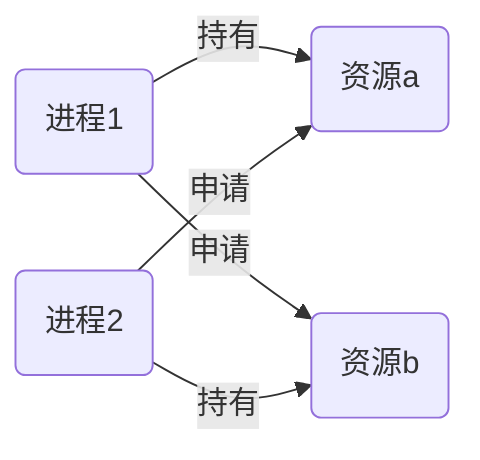

# 死锁

[TOC]

## 死锁的概念

死锁指进程因互相竞争资源而造成的僵持局面，如下图

## 死锁的必要条件

要形成死锁就必须具备以下四个必要条件

1. 资源互斥：每个资源只能被一个进程持有
2. 不可剥夺：当一个进程持有资源时，该资源不可被外部抢占，只能被持有线程释放
3. 请求与保持：一个进程在持有一个资源时又去申请新的资源
4. 循环等待：系统中进程对资源的请求形成环路

## 死锁的预防

资源互斥由于资源的特性不可破坏，所以破坏死锁的其他三个必要条件中的任意一个

1. 破坏“不可剥夺”条件：当进程请求新的资源失败时，释放已持有资源，而后只有同时获取到已持有资源和新的资源时才能继续进行
2. 破坏请求与保持条件
   1. 使用静态分配策略，每个进程启动时分配给其所需要的全部资源，否则则不启动
   2. 使用动态分配策略，每个进程在申请资源时其本身不占有资源
3. 破坏”循环等待“条件：采用资源静态分配策略，将资源根据紧张程度进行编号，资源越紧缺编号越大，进程申请资源时只有获取了编号较小的资源才能申请编号较大的资源

## 死锁的避免

银行家算法

Available：1 6 2 2

| process | allocation | need    |
| ------- | ---------- | ------- |
| P0      | 0 0 3 2    | 0 0 1 2 |
| P1      | 1 0 0 0    | 1 7 5 0 |
| P2      | 1 3 5 4    | 2 3 5 6 |
| P3      | 0 3 3 2    | 0 6 5 2 |
| P4      | 0 0 1 4    | 0 6 5 6 |

上题中有四种资源，系统持有资源数分别时1 6 2 2，每个进程对资源的持有和需求如上表，每个进程在完成后释放所有资源，求一个安全序列

## 死锁的处理

- 重启
- 结束闭环中的进程使其释放资源