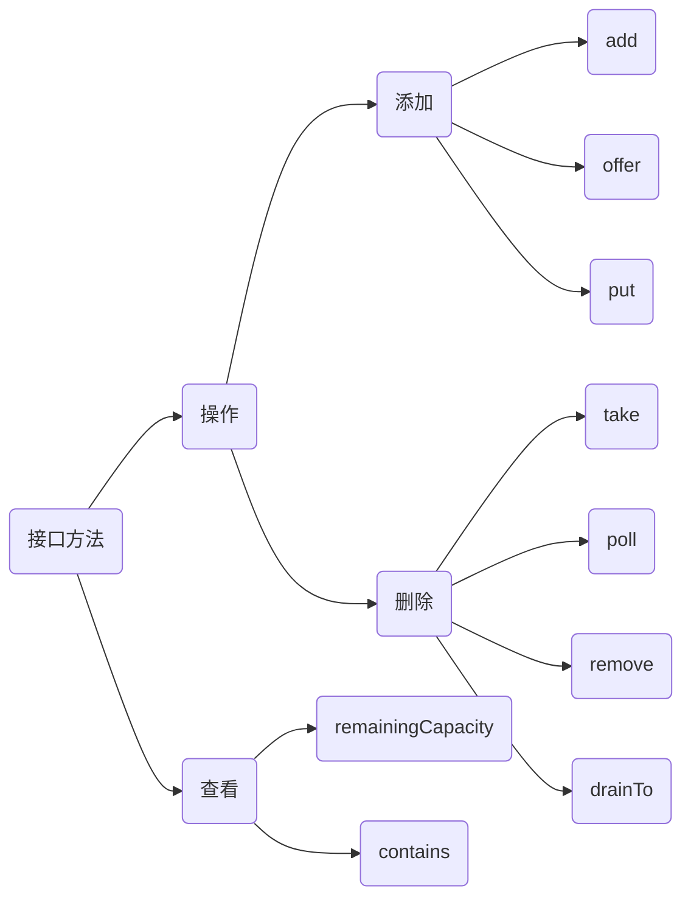

# 阻塞队列

说到多线程，就一定绕不开阻塞队列，本文就阻塞队列的共性与不同进行分析归纳

所有的阻塞队列都实现了BlockingQueue接口，那我们就首先来看看BlockingQueue接口都有哪些方法

队列分类

- 直接交付（SynchronousQueue）

  不排队，直接新建线程来执行

- 无界队列（LinkedBlockingQueue）

  队列永远不会满，此时核心线程数可以和最大线程数一样

- 有边队列（ArrayBlockingQueue）