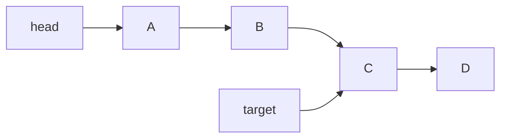
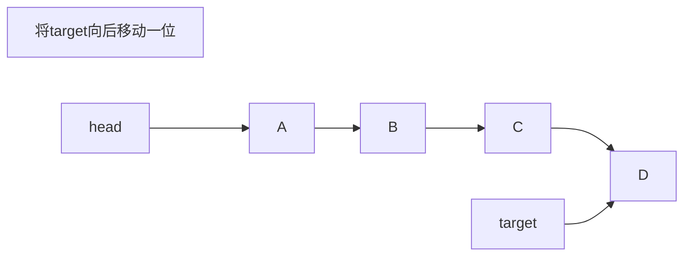
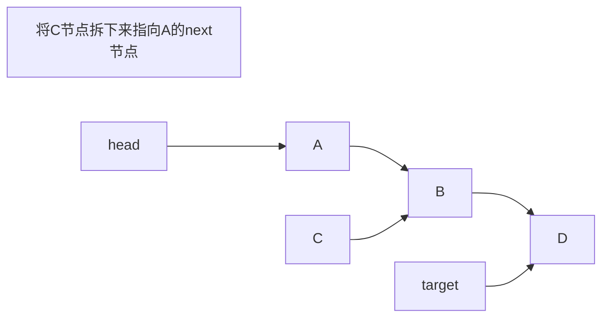
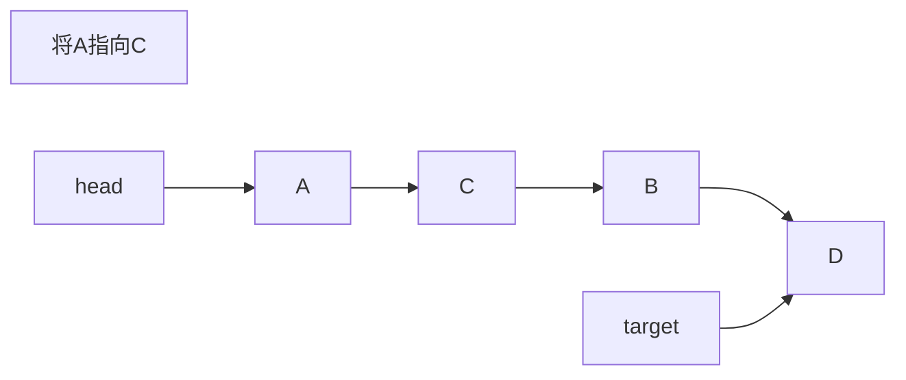

# 链表

## 链表反转

```mermaid
graph LR
	A-->B
	B-->C
	C-->D
	head-->A
	target-->C
```

```mermaid
graph LR
	将target向后移动一位
	A-->B
	B-->C
	C-->D
	head-->A
	target-->D
```

```mermaid
graph LR
将C节点拆下来指向A的next节点
	A-->B
	B-->D
	C-->B
	head-->A
	target-->D
```

```mermaid
graph LR
将A指向C
	A-->C
	B-->D
	C-->B
	head-->A
	target-->D
```

