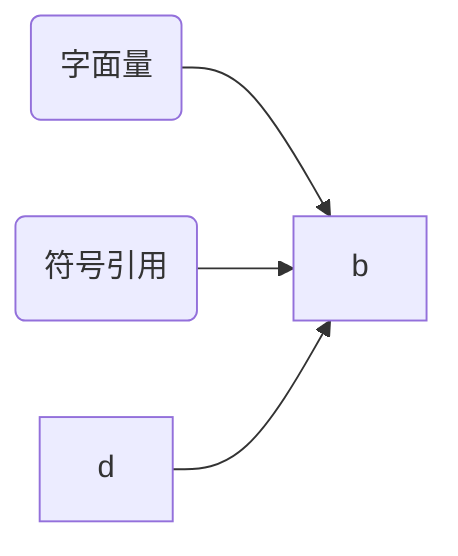

# Java内存区域

在我们的日常编程中，常常会有这样的疑问

- new的对象究竟储存在哪里呢？

- 对象究竟是根据哪里的模板生成的呢？

- 为什么我进入一个方法并执行完毕之后还能返回我进入的位置呢？

  ......

那么本文就来从Java内存区域的角度来说一说这些问题

如上图所示，Java内存区域分为如上5块儿

- Heap：Java堆。用于存放对象实例和数组，分为年轻代和老年代，年轻代又可分为survior区和Eden区

- 虚拟机栈：最小单元为栈帧，每个方法的开始和完成就对应着一个栈帧的入栈与出栈操作，每个虚拟机栈都是线程独立的。在栈顶的栈帧被称为当前栈帧，当前线程只处理当前栈帧。在虚拟机栈中保存了动态链接、操作数栈、局部变量表、返回地址等信息。

  - 动态链接：符号引用在编辑阶段就转为直接引用的称为静态连接，在程序运行时解析为直接引用的程为动态链接

  - 操作数栈：存放操作数

    > 一条add指令需要两个操作数，这两个操作数就会放在操作数栈中，当执行add时进行出栈相加操作

  - 局部变量表：存储方法参数信息以及方法中定义的局部变量

  - 返回地址：正常返回时取PC计数器中的地址，异常返回则由异常处理器处理

- 本地方法栈：native方法所使用的栈

- 程序计数器：记录当前线程执行到了哪里，线程独立

- 方法区：非堆，在Java7之前版本使用永久代实现，存放静态常量、类信息、运行时常量池。在jdk1.7中将字符串常量池移到堆中，在jdk1.8中去除了永久代，采用元空间

## Q&A

运行时常量池中存放的时字面量和符号引用，字符串常量池中存放的是字符串，这二者有什么关系？

元空间和直接内存都使用的是本地内存，二者有什么关系吗？

jdk6中的方法区所存储的东西在jdk7和jdk8分别做了哪些转移？

### 溢出测试

1. 字符串常量池溢出
2. 类信息溢出
3. 常量溢出
4. 静态变量溢出