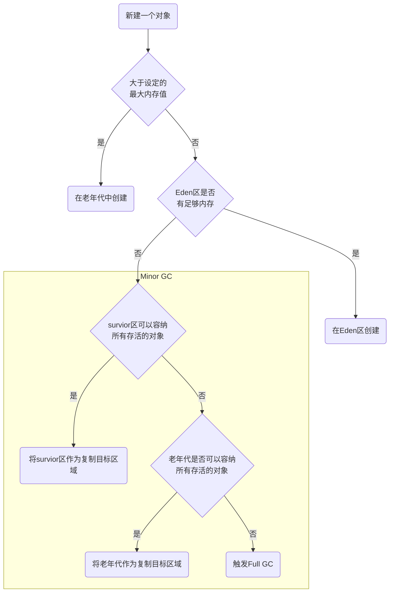

# 内存分配与回收策略

Java内存中，GC分为两类，Minor GC和Full GC。Minor GC针对年轻代进行GC，Full GC针对整个堆进行GC。JVM的内存晋升流程图如下

在survior区中的对象，在符合两种情况时，也是可以晋升到老年代的

- survior区中的对象，每经历过一次Minor GC而没有被回收掉就会使其年龄+1，当年龄大于我们设定的年龄值时，就会晋升到老年代中
- 如果survior区中同一年龄的对象大于Survior区的一半，那么这些对象也会晋升到到老年代