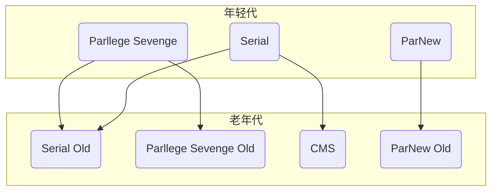
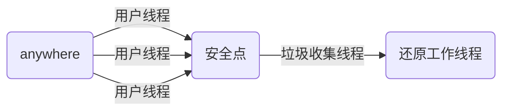
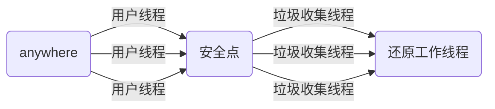

# 垃圾收集器

上一章中说到了垃圾回收算法，那么垃圾回收算法是如何实现以及在jvm中是如何体现的呢？这就是本章所要说的内容。jvm中使用垃圾回收器来实现垃圾回收算法

在Hotspot中，垃圾回收使用的是分代回收算法。将java堆分为了年轻代和老年代。分别使用不同的垃圾收集器来进行垃圾回收，如下图所示

接下来我们逐一分析这些垃圾收集器

## 年轻代收集器

Hotspot在年轻代中有三种收集器可以供大家选择：Serial、ParNew、Parllege Sevenge

### Serial

Serial是最古老的垃圾收集器，它使用的是标记-复制法进行垃圾回收。该垃圾收集器是一个单线程收集器，其收集垃圾的过程如下图

### ParNew

ParNew垃圾收集器是Serial的多线程版本，它们也共用了很多代码，但是在一些情况下ParNew并不比Serial更高效，如果是在单CPU的机子上，Serial由于没有线程的切换，反而效果更好，其收集垃圾的过程如下图

### PS

PS处理器和前两种处理器最大的不同在于其关注的并不是最短停顿时间，而是吞吐量
$$
吞吐量=程序运行时间/(程序运行时间+垃圾回收时间)
$$
PS处理器也是一个并发处理器，在PS处理器中，我们可以设置两个参数来对其进行控制

- 吞吐量
- 最大停顿时间

需要注意的是，并不是将最大停顿时间设置的很小系统就越快，PS处理器会通过频繁的垃圾回收来保证最大停顿时间

## 老年代

#### Serial Old

Serial Old是Serial的老年代版本，采用标记整理算法，也是一个单线程的处理器

#### PS Old

在PS Old垃圾收集器出现之前