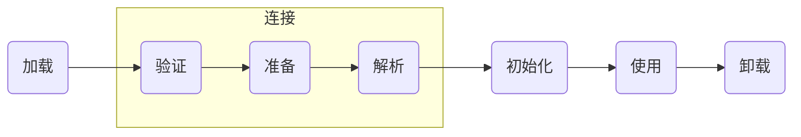

# 类加载机制

[TOC]

一个类时如何被虚拟机加载运行？究竟经历了哪些步骤呢？本文就Java中类的加载机制进行详细的讲解。

## 加载过程

一个类从被虚拟机加载直到被虚拟机卸载的过程程为类的生命周期，可分为以下7个步骤

每个类都会经历以上7个步骤，其中加载、验证、准备、初始化、卸载这五个步骤将按部就班的**开始**，而解析则不一定，解析可能会在初始化之后才开始进行

### 加载

加载阶段的工作，就是获取类的二进制流，并将其放入虚拟机中

1. 类加载器根据类的全限定名获取类的二进制流
2. 根据二进制流所代表的数据结构在方法区生成对应的数据结构
3. 根据数据结构在方法区生成java.lang.Class对象作为该类的入口

类的加载阶段是程序员们可操作性最大的阶段、我们可以使用虚拟机自带的类加载器，也可以自定义类加载器

### 验证

由于二进制流的获取途径后很多，可以通过Java文件、网络、直接使用二进制编辑器编写、数据库、JSP，所以就需要对加载进来的class进行验证，主要验证一下4个方面

1. 文件格式验证
2. 元数据验证（Java语法验证）
3. 字节码验证（自卫验证，防止有对虚拟机有害的代码）
4. 符号引用验证（是否每个符号引用都可以找到对应的类）

验证阶段和加载阶段有一部分时交叉进行的，而且如果验证程序是没有问题的话在实施阶段可以通过*-Xverify:none*来关闭

### 准备

再通过验证之后，虚拟机就要对所有的类成员变量进行内存分配，当然，这个时候的类成员变量还是其零值（被final修饰的是实际值）

### 解析

在解析阶段，对

### 初始化

在初始化阶段，虚拟机为每一个类收集并生成\<clint>方法，每个\<clint>方法由static静态代码块和静态赋值语句生成，如果一个类中没有上述代码则不生成\<clint>方法。每个类的\<clint>方法执行之前其父类一定已经初始化，所以第一个初始化的类一定是Object。接口则不需要

当且仅当类在以下五种情况下会进行初始化

1. 当遇到new、putstatic、getstatic、invoke指令时
2. 