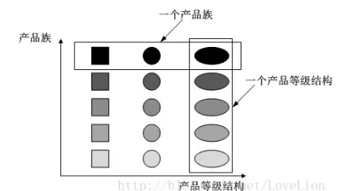

# 设计模式——工厂模式

工厂模式属于创建型设计模式。正如其名字一样，在工厂模式中，类的创造不通过*new*来实现，而是从类工厂中获取

工厂模式针对不同的业务场景同样也会分出几类

- 简单工厂模式
- 工厂方法模式
- 抽象工厂模式

### 场景假设

假设我们现在想要吃汉堡，但是汉堡既有KFC的，又有金拱门的，该如何选择呢？

### 示例

首先使用简单工程模式，类图如下


key代码如下

```java
public class SimpleFactory {
    public Hamburger getInstance(String type) {
        if(type == "KFC"){
            return new KFCHamburger();
        }else if(type == "McD"){
            return new McDHamburger();
        }else {
            return null;
        }
    }
}
```

我们创作了一个既可以生产KFC汉堡，又可以生产金拱门汉堡的工厂，当我们需要一个汉堡时，我们只需要告诉这个工厂我们想要的汉堡类型就可以了。

但是这时我们突然又想吃德克士的汉堡了？当前工厂并不能满足我们的需求，这时我们就需要在原有类的基础上进行更改，如此一来就违反了我们的7大原则之一的**开闭原则**。

#### 小结

> 优点
>
> - 简单
> - 根据外界条件明确获取指定对象
>
> 缺点
>
> - 不够灵活
> - 当产品过多时，工厂代码变得非常复杂

于是乎我们就有了新的考虑与设计——工厂方法模式，类图如下


key代码如下

```java
public class KFCHamburgerFactory extends AbstractFactory {
    @Override
    public IHamburger getHamburger() {
        return new KFCHamburger();
    }
}

public class McDHamburgerFactory extends AbstractFactory {

    @Override
    public IHamburger getHamburger() {
        return new McDHamburger();
    }
}

public class DicosHamburgerFactory extends AbstractFactory {
    @Override
    public IHamburger getHamburger() {
        return new DicosHamburger();
    }
}
```

在工厂方法模式中，每一类产品都有一个专门的工厂负责生产，当我们需要新的产品时，增加一个工厂就可以了。

#### 小结

> 优点
>
> - 基类提供缺省实现，子类可重写。增加了灵活性
> - 屏蔽产品类，调用者无需了解具体产品类
> - 新增产品时无需修改已有代码，符合开闭原则

但是这个时候我们不想吃汉堡了，突然想吃热狗

热狗在KFC、金拱门、德克士都是有的，如果仅仅是通过增加工厂的方式的话就会造成工厂类的激增，这是我们不愿意看到的，于是乎，抽象工厂模式应运而生

在理解抽象工厂模式之前，我们先来了解一个概念——**产品族**

如上图，不同厂家生产的汉堡属于同一个产品等级，同一厂家生产的不同事物属于同一个产品族

抽象工厂模式类图如下


key代码

```java
public class DicosFactory extends AbstractFactory {
    @Override
    public IHamburger getHamburger() {
        return new DicosHamburger();
    }

    @Override
    public IHotDog getHotDog() {
        return new DicosHotDog();
    }
}

public class KFCFactory extends AbstractFactory {
    @Override
    public IHamburger getHamburger() {
        return new KFCHamburger();
    }

    @Override
    public IHotDog getHotDog() {
        return new KFCHogDog();
    }
}

public class McDFactory extends AbstractFactory {
    @Override
    public IHamburger getHamburger() {
        return new McDHamburger();
    }

    @Override
    public IHotDog getHotDog() {
        return new McDHotDog();
    }
}

```

于是在这种模式下，我们解决了工厂类激增的问题，当然也引入了一个新的问题，那就是当我们需要新增加一个产品族时候，会需要将所有类都修改一次——如果之前的厂商也需要生产这种产品的话

#### 小结

> 优点
>
> - 保证了客户端代码使用的是同一产品族中的产品
> - 减少了工厂的数量，避免了工厂类急增
> - 增加产品族时无需修改已有代码，符合开闭特性
>
> 缺点：增加产品等级时异常麻烦，需要修改所有工厂类（如果原工厂类需要新增的产品等级）

### 总结

在我看来，其实工厂方法模式和抽象工厂模式的区别只是在于业务的复杂程度，或者说工厂方法模式是产品类没有族关系的抽象工厂模式的一种表现。而对于简单工厂模式，最突出的特点应该是其实现简单，同样其缺点也很突出

|              | 工厂方法模式 | 抽象工厂模式 |
| ------------ | ------------ | ------------ |
| 开闭原则     | √            | 乄           |
| 里氏代换原则 | √            | √            |
| 迪米特原则   | √            | √            |

### 参考博客

[（工厂模式）产品族和产品等级](https://www.jianshu.com/p/5fb1e21c4d19)