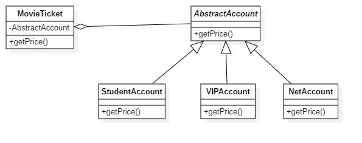

# 设计模式——策略模式

### 场景模拟

电影院买票时都会给与一些优惠，由于买票途径或买票人身份的不同会有不同的折扣，现在通过网络订票可拥有88折优惠，学生票拥有5折优惠，使用程序实现这一场景

```java
public class MovieTicket {
    private double price;

    public MovieTicket(double price) {
        this.price = price;
    }

    public double getPrice (String type) {
        if (StringUtils.equals(type, "student")) {
            return price * 0.5;
        } else if (StringUtils.equals(type, "net")) {
            return price * 0.88;
        } else {
            return price;
        }
    }

    public static void main(String[] args) {
        MovieTicket ticket = new MovieTicket(40);
        System.out.println("student price:" + ticket.getPrice("student"));
        System.out.println("net price:" + ticket.getPrice("net"));
    }

}
```

可以看到，我们现在实现了这一场景，每次通过外界传给我们票的类型来乘以不同的折扣来返回票价。这时候影院希望通过VIP来锁住更多的用户，VIP票价全场7折，这时候我们的程序就需要在`getPrice`方法中再增加一个`if-else`来实现这一需求，那么很明显，这违反了我们的开闭原则。

在这里，发生变化的是折扣的种类，所以我们将不同的折扣方式提取称不同的类，代码如下

```java
public abstract class AbstractAccount {
    public abstract double getPrice(double price);
}

public class NetAccount extends AbstractAccount {
    @Override
    public double getPrice(double price) {
        return price * 0.88;
    }
}

public class StudentAccount extends AbstractAccount{
    @Override
    public double getPrice(double price) {
        return price * 0.5;
    }
}

public class VIPAccount extends AbstractAccount {
    @Override
    public double getPrice(double price) {
        return price * 0.7;
    }
}
```
于是乎我们的电影票代码就变成了如下

```java
public class MoiveTicket {
    private double price;
    @Setter
    private AbstractAccount account;

    public MoiveTicket(double price) {
        this.price = price;
    }

    public double getPrice() {
        return account.getPrice(this.price);
    }

    public static void main(String[] args) {
        MoiveTicket ticket = new MoiveTicket(40);
        ticket.setAccount(new VIPAccount());
        System.out.println("VIP price:" + ticket.getPrice());;
    }
}
```

这个时候，如果我们再新增新的打折策略，比如年终优惠全场66折等待，就只需要在新增一个年终优惠策略而不需要再去更改原有代码，符合了开闭原则

### 总结

我们更改后的代码类图如下



可以看到，上述可提取出三个角色

- AbstractStrategy：抽象策略类
- Strategy：策略类
- Client：客户类

其中在抽象策略类中规定所有实现类都应该实现的策略，在具体的实现类中实现。

### 定义及特点

定义一系列算法类，将每一个算法封装起来，并让它们可以相互替换，策略模式让算法独立于使用它的客户而变化，也称为政策模式(Policy)。策略模式是一种对象行为型模式。

策略模式有什么优点和缺点呢？

优点

- 策略模式可以完美的实现开闭原则
- 策略模式可以使得不同的算法形成算法族
- 使用策略模式可以避免多重判断语句
- 策略类提供了一种复用机制

缺点

- 客户端必须知道所有策略类
- 当策略类过多时会造成类的激增

