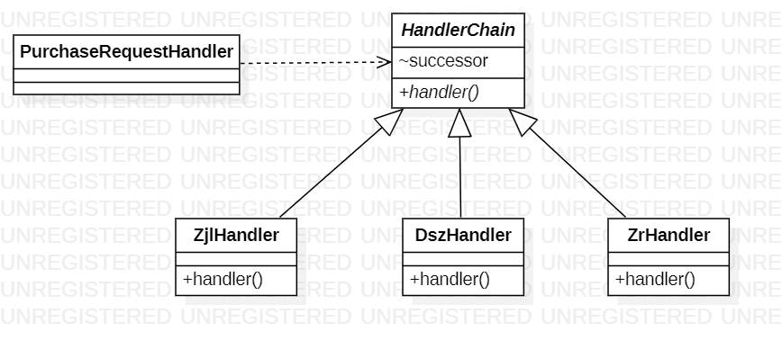

# 设计模式——责任链模式

[toc]

### 情景假设

假设现在你是一名采购员，你需要采购一些物品，而采购的资金是需要公司高层审批，不同的金额归不同的领导来审批，其中主任可以审批100元以内的金额，总经理可以审批1000以内的金额，董事长可以审批10000以内的金额

这里我们初始化一个订单类和一个采购类来完成这个操作

```java
/**采购请求处理类*/
public class PurchaseRequestHandler {

    public void buy(Order order) {
        if (order.getMoney() < 100) {
            this.zrHandler(order);
        }
        if (order.getMoney() < 1000) {
            this.zjdHandler(order);
        }
        if (order.getMoney() < 10000) {
            this.dszHandler(order);
        }
    }

    private void zrHandler(Order order) {}

    private void dszHandler(Order order) {}

    private void zjdHandler(Order order) {}

}

/**订单类*/
@Getter
@Setter
@AllArgsConstructor
public class Order {

    private int money;
    private Object goods;

}
```

这里需求发生不考虑变化的情况，我们可以看到在`buy`方法里的圈复杂度将会随着领导层次的递增而增加，这本就是不能接受的代码逻辑之一。

### 需求更改

这时我们发现突然有一个订单的金额大于了10000，这时就需要董事会开会来审批，而如果我们想要处理这种新增情况就只能通过再`buy`方法内增加一个if来解决，这明显违法了开闭原则，于是我们将发生变化的逻辑提取出来

```java
/**抽象处理类*/
@Setter
@Getter
public abstract class HandlerChain {
    HandlerChain successor;
    abstract void handler(Order order);
}
/**主任处理类*/
public class ZrHandler extends HandlerChain {
    @Override
    void handler(Order order) {
        if (order.getMoney() < 100) {

        } else {
            this.getSuccessor().handler(order);
        }
    }
}
/**总经理处理类*/
public class ZjlHandler extends HandlerChain {
    @Override
    void handler(Order order) {
        if (order.getMoney() < 1000) {

        } else {
            this.getSuccessor().handler(order);
        }
    }
}
/**董事长处理类*/
public class DszHandler extends HandlerChain {
    @Override
    void handler(Order order) {
        if (order.getMoney() < 10000) {

        } else {
            this.getSuccessor().handler(order);
        }
    }
}
```

我们先将处理逻辑抽出如上述代码，这个时候我们如果再增加一个董事会就只需要再增加一个董事长处理类就可以了，然后在我们的`采购请求处理类`中将处理类制作成链表的结构。

```java
public class PurchaseRequestHandler {

    private HandlerChain chain;

    public PurchaseRequestHandler() {
        makeChain();
    }

    private void makeChain() {
        ZrHandler handler = new ZrHandler();
        ZjlHandler handler1 = new ZjlHandler();
        DszHandler handler2 = new DszHandler();
        handler.setSuccessor(handler1);
        handler1.setSuccessor(handler2);
        chain = handler;
    }

    public void buy (Order order) {
        chain.handler(order);
    }

}
```

可以看到，我们的`buy`方法已经精简为一行代码了，现在的代码也是符合开闭原则的。

### 总结

上述代码类图如下



在上述代码中，我们可以提取出这么几个概念

- 抽象处理类：它定义了一个处理请求的接口，一般设计为抽象类，由于不同的具体处理者处理请求的方式不同，因此在其中定义了抽象请求处理方法
- 具体处理类：他是具体处理的类，继承于抽象处理类，负责处理具体的业务以及向其继任者传递请求

### 特点

#### 优点

- 符合开闭原则
- 链中的对象不需要知道链的结构，也不需要负责链的创建，降低了系统的耦合度

#### 缺点

- 不保证请求一定会被处理
- 当责任链过长时，系统性能会受到影响
- 建链不当可能导致系统死循环问题

### 变形

#### 纯责任链模式和不纯的责任链模式

在demo代码中，我们的订单只有领导层的某个领导处理，这种一个请求只有链中的一个handler处理时，这种就是纯责任链模式，那么相对的，如果每个handler都对请求进行处理，处理完之后继续交给后继者继续处理的话，这种就是不纯的责任链模式

#### 链表和数组

在demo代码中，我们使用链表的形式来组合链，除了链表的方式之外，我们还可以使用一个List来存储所有的handler，然后通过循环遍历list来处理请求